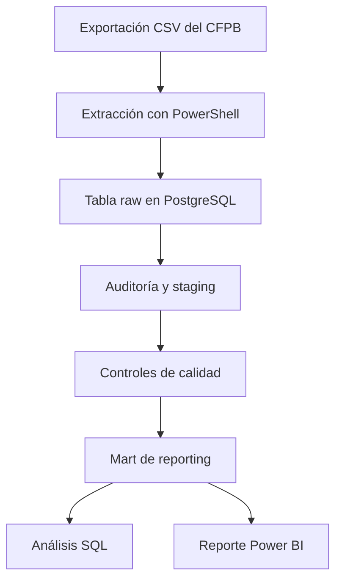

# Financial Complaints Analytics

[English](README.md) | **Español**

> Un proyecto reproducible en PostgreSQL y Power BI para monitorear reclamos de consumidores en los sectores bancario y de pagos de Estados Unidos.

**Estado:** MVP listo para portfolio. El repositorio incluye el flujo de extracción, el pipeline SQL, evidencia de auditoría, análisis de negocio, el reporte final de Power BI de dos páginas, vistas previas del dashboard y documentación de métricas.


## Descripción del proyecto

Las instituciones financieras reciben reclamos vinculados con distintos productos y procesos operativos, pero los conteos crudos requieren una preparación e interpretación cuidadosas antes de poder respaldar decisiones de gestión.

Este proyecto transforma registros públicos de la [Consumer Complaint Database del Consumer Financial Protection Bureau (CFPB)](https://www.consumerfinance.gov/data-research/consumer-complaints/) en un flujo analítico orientado a un stakeholder simulado: un **Gerente de Operaciones de Clientes o de Compliance**. Permite monitorear e investigar el volumen de reclamos, sus tendencias, la concentración por producto y problema, los patrones por compañía, la puntualidad de las respuestas y la disponibilidad de narrativas.

El objetivo es brindar soporte descriptivo para la toma de decisiones, no predecir reclamos, realizar evaluaciones causales ni construir un ranking general de calidad de compañías.

## Stack tecnológico

PostgreSQL · SQL · PowerShell · `curl.exe` · Power BI · Power Query · DAX · Git/GitHub · Markdown

## Preguntas de negocio

- ¿Cómo cambió el volumen de reclamos entre 2023 y 2025?
- ¿Qué productos y problemas concentran la mayor proporción de reclamos?
- ¿Qué compañías aparecen con mayor frecuencia en el contexto de análisis seleccionado?
- ¿Con qué regularidad los reclamos recibieron una respuesta registrada como puntual?
- ¿Dónde deberían priorizar nuevas investigaciones los equipos de Operaciones o Compliance?

## Alcance del MVP

| Dimensión | Definición |
|---|---|
| Período | 2023-01-01 a 2025-12-31 |
| Geografía | Estados Unidos |
| Unidad de análisis | Un reclamo de consumidor publicado |
| Fuente | CFPB Consumer Complaint Database |
| Dominio | Banca de consumo y pagos |
| Reporting | Dos páginas visibles de Power BI en 16:9 y una página de QA oculta |

Se extraen cuatro categorías de producto de la fuente y se armonizan en tres familias analíticas:

- `Credit card`;
- `Checking or savings account`;
- `Money transfer, virtual currency, or money service`.

La categoría histórica `Credit card or prepaid card` se resuelve mediante `product + sub_product`. Los registros de tarjetas de crédito se asignan a la familia moderna; los registros de tarjetas prepagas se conservan en raw, pero se excluyen de este MVP.

## Dashboard

El reporte final se encuentra en [`powerbi/financial_complaints_analytics.pbix`](powerbi/financial_complaints_analytics.pbix). Su modelo, medidas, páginas, interacciones y reconciliación con SQL están documentados en la [guía del reporte de Power BI](powerbi/README.md).

### Resumen ejecutivo

La primera página combina filtros de Año y Producto con Total de reclamos, Crecimiento interanual, Tasa de respuesta puntual, Tasa de narrativas, volumen mensual de reclamos, mix de productos y los cinco principales problemas.

### Análisis de compañías y problemas

La segunda página presenta las diez compañías con mayor volumen de reclamos junto con su tasa de respuesta puntual, además de los problemas, subproductos y categorías de respuesta con mayor volumen. El volumen por compañía se utiliza para priorizar investigaciones y no se presenta como un ranking de calidad ajustado por exposición.


El archivo `.pbix` también conserva una página de QA oculta, utilizada para reconciliar contra PostgreSQL resultados globales, anuales, por producto, de respuesta puntual y de disponibilidad de narrativas.

## Principales hallazgos

1. **El volumen de reclamos aumentó de forma considerable.** El mart contiene 118.035 reclamos en 2023, 145.554 en 2024 y 258.792 en 2025. Las variaciones anuales correspondientes son +23,31 % y +77,80 %.
2. **Las tarjetas de crédito son la familia de producto más grande en el período completo.** Representan 220.381 reclamos, equivalentes al 42,19 % del mart validado.
3. **Un grupo reducido de problemas concentra gran parte de la carga.** Los cinco principales problemas representan el 51,29 % de los reclamos; `Managing an account` reúne por sí solo 103.749.
4. **El volumen por compañía está concentrado.** Las diez compañías con mayor volumen representan el 58,33 % del mart. Esto las convierte en puntos de partida útiles para investigar, pero no establece diferencias comparativas de calidad de servicio.
5. **La puntualidad registrada de las respuestas es consistentemente alta.** Un total de 518.681 reclamos fue marcado como puntual, lo que produce una tasa del 99,29 %. Hay narrativa disponible para 302.021 reclamos, equivalentes al 57,82 %.

Los resultados detallados, las tablas de respaldo y los límites de interpretación se encuentran en el [análisis de negocio](docs/business_analysis.md).

## Prioridades de investigación recomendadas

- **Investigar enero de 2025 antes de operacionalizar conclusiones de crecimiento.** Determinar si la concentración refleja tiempos de publicación, acumulación de casos, mix de compañías, clasificación u otro factor del proceso de datos.
- **Priorizar combinaciones producto–problema de alto volumen.** Comenzar con `Managing an account` para cuentas corrientes o de ahorro y `Other transaction problem` para servicios de transferencias, y luego segmentar por compañía y categoría de respuesta.
- **Revisar los reclamos no respondidos a tiempo dentro de su contexto.** Enfocarse en segmentos que combinen volumen relevante con tasas observadas más bajas, considerando la puntualidad como un indicador de proceso y no como una medida de calidad de resolución.

Estas son prioridades de investigación derivadas de patrones descriptivos, no recomendaciones causales.

## Arquitectura



| Capa | Responsabilidad |
|---|---|
| PowerShell + `curl.exe` | Descargar particiones, validar archivos, detectar IDs duplicados y generar un manifest con hashes |
| PostgreSQL raw | Preservar todas las columnas fuente como texto antes de transformarlas |
| Auditoría SQL | Evaluar integridad, valores faltantes, taxonomía, normalización e impacto del cleaning sin modificar raw |
| Staging SQL | Aplicar casteos, exclusiones, armonización de productos y campos derivados justificados por la auditoría |
| Controles de calidad SQL | Validar granularidad, población, campos requeridos, mapeos y cobertura temporal |
| Reporting SQL | Exponer un mart a nivel de reclamo y una dimensión calendario continua |
| Power BI | Proporcionar un modelo semántico pequeño, medidas DAX reutilizables, filtros y páginas de reporte |
| Markdown | Publicar metodología, definiciones, hallazgos, limitaciones y pasos de reproducción |

La lógica de transformación permanece en PostgreSQL y no se duplica en Power Query.

## Calidad y limpieza de datos

La ejecución publicada comienza con 525.156 filas raw y la misma cantidad de IDs de reclamo distintos. La auditoría fundamenta 2.775 exclusiones documentadas:

- 2.769 reclamos históricos de tarjetas prepagas fuera del alcance de las tres familias;
- 5 reclamos sin campos requeridos para su clasificación;
- 1 combinación inconsistente de producto y subproducto de cuentas.

La población final de staging y del mart es de 522.381 reclamos únicos. Los 18 controles de calidad de staging resultan satisfactorios.

Otras decisiones incluyen:

- definir el alcance mediante `date_received`, aun cuando `date_sent_to_company` sea posterior;
- conservar subproblemas y narrativas opcionales faltantes en lugar de imputarlos;
- derivar `has_narrative` únicamente como indicador de disponibilidad;
- consolidar tres variantes verificadas de mayúsculas y minúsculas en nombres de compañías, sin aplicar resolución general de entidades.

La justificación completa está disponible en la [auditoría de datos](docs/data_audit.md) y en la [evidencia de auditoría](data/audit/) versionada.

## Modelo de reporting y KPIs

Power BI importa únicamente:

- `mart_complaints`, con una fila por reclamo validado;
- `dim_calendar`, con una fila por fecha entre 2023 y 2025.

El modelo utiliza una relación activa de uno a muchos desde `dim_calendar[date]` hacia `mart_complaints[date_received]`, con filtrado en una sola dirección.

Las medidas principales son:

- Total Complaints;
- Complaints Previous Year;
- YoY Complaint Growth;
- Timely Complaints y Timely Response Rate;
- Complaints with Narrative y Narrative Rate.

Las definiciones, fórmulas DAX, comportamiento de filtros, reconciliación SQL y advertencias están publicadas en el [diccionario de KPIs](docs/kpi_dictionary.md). Los campos de reporting y sus derivaciones se documentan en el [diccionario de datos](docs/data_dictionary.md).

## Reproducir el flujo de trabajo

### Requisitos

- Windows PowerShell o PowerShell con acceso a `curl.exe`;
- PostgreSQL y el cliente de línea de comandos `psql`;
- acceso de red a la exportación de reclamos del CFPB;
- Power BI Desktop para abrir o actualizar el reporte.

Los comandos deben ejecutarse desde la raíz del repositorio, ya que el loader SQL utiliza rutas relativas dentro de `data/raw/`.

### Elegir un recorrido de revisión

**Revisión rápida — no requiere base de datos**

- inspeccionar la evidencia de auditoría versionada en `data/audit/`;
- leer `docs/data_audit.md` y `docs/business_analysis.md`;
- revisar los scripts SQL y el diccionario de KPIs;
- inspeccionar las capturas del dashboard o abrir el `.pbix` versionado.

**Reproducción completa**

Descargar las extracciones actuales del CFPB, construir en PostgreSQL las capas desde raw hasta el mart de reporting, ejecutar el análisis de negocio y actualizar Power BI mediante los pasos siguientes.

### Configuración de PostgreSQL

Crear una base de datos vacía antes de ejecutar el pipeline:

```powershell
createdb -h <host> -p <port> -U <user> financial_complaints_analytics
```

Los datos de conexión pueden proporcionarse mediante los argumentos de los comandos siguientes o mediante las variables estándar de PostgreSQL `PGHOST`, `PGPORT`, `PGDATABASE`, `PGUSER` y `PGPASSWORD`. El repositorio no requiere ni lee un archivo `.env`.

Comprobar la conexión antes de descargar los datos:

```powershell
psql -h <host> -p <port> -U <user> `
  -d financial_complaints_analytics `
  -c "SELECT current_database();"
```

### 1. Descargar y validar las particiones fuente

```powershell
powershell -ExecutionPolicy Bypass -File .\scripts\download_data.ps1
```

El extractor genera ocho particiones CSV fijas y no superpuestas, además de `extraction_manifest.csv`. Por defecto, los archivos existentes se validan y conservan; se puede usar `-Force` para reconstruirlos.

La extracción publicada contiene 525.156 filas y ocupa aproximadamente 480 MiB. La descarga, validación de CSV, carga en PostgreSQL y ejecución de la auditoría pueden tardar más que unos pocos minutos, según la velocidad de red y el hardware local. Este es el recorrido de reproducción completa, no el de revisión rápida.

### 2. Construir el pipeline de base de datos

```powershell
psql -h <host> -p <port> -U <user> `
  -d financial_complaints_analytics `
  -f sql/00_run_pipeline.sql
```

El runner ejecuta desde la carga raw hasta la creación del mart con `ON_ERROR_STOP`. Los scripts individuales también pueden ejecutarse en orden numérico. Cualquier control de calidad de staging fallido detiene el runner antes de crear el mart de reporting.

### 3. Ejecutar el análisis de negocio

```powershell
psql -h <host> -p <port> -U <user> `
  -d financial_complaints_analytics `
  -f sql/06_business_analysis.sql
```

Este script se mantiene intencionalmente fuera del runner porque devuelve resultados analíticos en lugar de crear una capa downstream.

### 4. Abrir o actualizar Power BI

Abrir `powerbi/financial_complaints_analytics.pbix` y seguir la [guía del reporte de Power BI](powerbi/README.md#refreshing-from-another-postgresql-instance) para configurar y actualizar la conexión PostgreSQL. La página de QA oculta permite comparar los resultados actualizados con los valores de referencia documentados.

Los archivos raw y los manifests generados se excluyen de Git. Los conteos reproducidos pueden variar si el CFPB vuelve a publicar registros de la fuente. El manifest publicado y versionado fija el baseline documentado, mientras que el manifest generado identifica la extracción local de una nueva ejecución. La [guía del directorio de datos](data/README.md) explica la política de artefactos.

## Estructura del repositorio

```text
financial-complaints-analytics/
├── data/
│   ├── audit/                       # Evidencia agregada de auditoría versionada
│   ├── raw/                         # Extracciones del CFPB generadas; ignoradas por Git
│   └── README.md                    # Guía de regeneración y artefactos de datos
├── docs/
│   ├── business_analysis.md         # Hallazgos descriptivos reconciliados
│   ├── data_audit.md                # Resultados de auditoría y decisiones de cleaning
│   ├── data_dictionary.md           # Definiciones de tablas de reporting
│   ├── images/                       # Capturas finales del dashboard
│   └── kpi_dictionary.md            # Definiciones de métricas, DAX y reconciliación
├── powerbi/
│   ├── financial_complaints_analytics.pbix
│   └── README.md                    # Modelo, páginas, medidas y QA del reporte
├── scripts/
│   └── download_data.ps1
├── sql/
│   ├── 00_run_pipeline.sql
│   ├── 01_load_raw_data.sql
│   ├── 02_data_audit.sql
│   ├── 03_clean_staging.sql
│   ├── 04_quality_checks.sql
│   ├── 05_reporting_mart.sql
│   └── 06_business_analysis.sql
├── .gitignore
├── LICENSE
├── README.es.md
└── README.md
```

## Limitaciones

- Los productos seleccionados no representan el universo completo de reclamos del CFPB.
- Los reclamos son reportes observados, no una muestra representativa de todas las experiencias de clientes.
- Los conteos por compañía y producto no cuentan con denominadores de clientes, cuentas, transacciones o participación de mercado.
- La respuesta puntual mide tiempos de respuesta, no calidad de resolución ni satisfacción.
- La taxonomía, las reglas de publicación y el comportamiento de presentación de reclamos del CFPB pueden afectar las tendencias observadas.
- Los nombres de compañías reciben una normalización limitada y auditada de mayúsculas y minúsculas, no una resolución completa de entidades.
- La disponibilidad de narrativas no implica que el texto sea representativo o esté listo para análisis.
- Enero de 2025 afecta considerablemente las comparaciones de crecimiento de 2025.

## Extensión diferida: enero de 2025

La señal no resuelta más importante corresponde a la combinación:

`Money transfer, virtual currency, or money service` → `Other transaction problem`

Registra 42.521 reclamos en enero de 2025, equivalentes al 55,09 % del total mensual y al 78,90 % del volumen de esa combinación durante 2025. El proyecto deliberadamente no clasifica este comportamiento como una anomalía validada ni le asigna una causa.

Una investigación posterior al MVP debería definir la línea base histórica, el volumen esperado y excedente, reglas de volumen mínimo, la concentración por compañía y canal, y posibles efectos del momento de publicación o de clasificación de la fuente. Ese trabajo podría respaldar una tercera página específica de Power BI, pero no forma parte del MVP actual de dos páginas.

## Fuera de alcance

- Machine learning, predicción o NLP;
- data warehouses en la nube, dbt o Airflow;
- reporting en tiempo real;
- enriquecimiento demográfico externo o con participación de mercado;
- Power Query o DAX avanzados, RLS, drill-through o navegación personalizada.

## Fuente de datos

Consumer Financial Protection Bureau. [Consumer Complaint Database](https://www.consumerfinance.gov/data-research/consumer-complaints/).

Este repositorio es un proyecto de portfolio independiente y no está afiliado ni respaldado por el CFPB.
