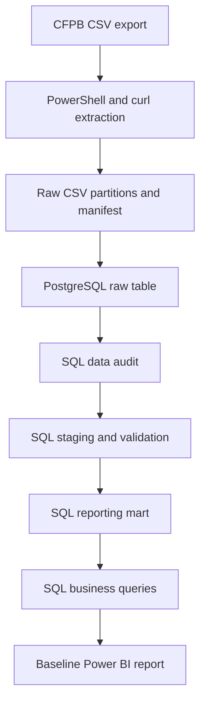

# Financial Complaints Analytics

> A reproducible SQL and Power BI analytics project for monitoring consumer complaints in U.S. banking and payments.

**Project status:** Active development — the reproducible extraction, PostgreSQL pipeline, business-analysis queries, and documented descriptive findings are implemented. A baseline Power BI file is committed. The product–issue anomaly method remains pending, and the report's page, KPI, Power Query, and DAX definitions are not yet documented in reviewable text.

## Project overview

Financial institutions receive complaints across products, service channels, and operational processes. Turning those records into reliable management information can help customer operations and compliance teams identify where complaint volume is concentrated, which issues are growing, and where response performance may require attention.

This project uses public records from the [Consumer Financial Protection Bureau (CFPB) Consumer Complaint Database](https://www.consumerfinance.gov/data-research/consumer-complaints/) to build a focused analytics workflow in PostgreSQL with a committed baseline Power BI report. The objective is monitoring and prioritization—not complaint prediction, causal evaluation, or a production data platform.

The MVP is deliberately limited to practical SQL, transparent data-quality decisions, basic Power Query and DAX, and concise analytical communication. Python, notebooks, cloud services, and advanced BI features are outside the initial scope.

## Business objective

The project frames an analytics request from a Customer Operations or Compliance Manager who needs to understand:

- how complaint volume and composition change over time;
- which products and issues account for most complaints;
- which product–issue combinations are growing most rapidly;
- how timely response rates vary across relevant segments; and
- which high-volume areas warrant further investigation.

Complaint counts are not used to rank the overall quality of financial institutions. The CFPB data does not include customer or transaction exposure, so complaint volume alone cannot establish a complaint rate or service-quality difference.

## MVP scope

- **Period:** 2023-01-01 through 2025-12-31, using three complete calendar years.
- **Geography:** United States.
- **Source:** CFPB Consumer Complaint Database.
- **Unit of analysis:** one published consumer complaint.
- **Domain:** consumer banking and payments.
- **Reporting target:** two Power BI pages with a limited set of business KPIs.

The extractor retains four CFPB source categories:

1. `Credit card or prepaid card`
2. `Credit card`
3. `Checking or savings account`
4. `Money transfer, virtual currency, or money service`

The staging layer reports three product families: credit cards, checking or savings accounts, and money transfer, virtual currency, or money services. Historical records from `Credit card or prepaid card` are assigned to the credit-card family only when the sub-product identifies a general-purpose, charge, or store credit card. Historical prepaid sub-products are excluded from the three-family MVP.

## Implementation status

| Component | Status | Repository evidence |
|---|---|---|
| Scope and source-category selection | Implemented | Fixed dates, product filters, and extraction partitions in `scripts/download_data.ps1` |
| Reproducible CFPB extraction | Implemented | PowerShell orchestration with `curl.exe`, temporary files, response checks, date-boundary validation, duplicate-ID checks, SHA-256 hashes, and an extraction manifest |
| Raw PostgreSQL schema and reload | Implemented | `sql/01_load_raw_data.sql` creates `raw_complaints`, atomically reloads eight CSV partitions, and reconciles row and distinct-ID counts |
| SQL data audit and evidence | Implemented | `sql/02_data_audit.sql` persists six audit views and exports five compact CSV artifacts; [the audit report](docs/data_audit.md) documents results and staging decisions |
| Staging and taxonomy harmonization | Implemented | `sql/03_clean_staging.sql` applies the audited exclusions, harmonizes the historical credit-card taxonomy, casts analytical fields, and derives traceable grouping and availability fields |
| Staging quality checks | Implemented | `sql/04_quality_checks.sql` verifies grain, expected row counts, required fields, product scope, mappings, derived fields, and date coverage with a PASS/FAIL summary |
| Reporting mart and calendar table | Implemented | `sql/05_reporting_mart.sql` creates complaint-level `mart_complaints` and a continuous 2023–2025 `dim_calendar` without duplicating staging logic |
| Ordered SQL pipeline | Implemented | `sql/00_run_pipeline.sql` executes raw loading through mart creation in dependency order with stop-on-error behavior |
| Business analysis queries | Implemented, except anomaly method | `sql/06_business_analysis.sql` covers dataset overview, change, mix, concentration, 2024–2025 growth, timely response, company and channel breakdowns, response categories, and narrative availability; section 12 deliberately contains no executable anomaly query |
| Published descriptive findings | Implemented | [The business-analysis report](docs/business_analysis.md) records reconciled results, interpretation limits, and the unresolved January 2025 signal |
| Power BI report | Baseline artifact committed; documentation pending | `powerbi/baseline.pbix` is present, but its pages, measures, Power Query steps, and reconciliation checks are not documented in text |

## Data workflow



Implemented steps preserve the source values in a text-based raw table so that type conversion, normalization, and exclusions remain explicit downstream decisions.

## Reproduce the implemented workflow

### Requirements

- Windows PowerShell or PowerShell with access to `curl.exe`.
- PostgreSQL with the `psql` command-line client.
- Network access to the CFPB complaint search API.
- Power BI Desktop to open the committed baseline report; it is not required to run the SQL workflow.

Run commands from the repository root so the relative `data/raw/` paths used by `psql` resolve correctly.

After downloading the source partitions, the implemented database build can be executed in dependency order with:

```powershell
psql -d <database_name> -f sql/00_run_pipeline.sql
```

The runner executes `01_load_raw_data.sql` through `05_reporting_mart.sql` and stops on the first error. `06_business_analysis.sql` is intentionally separate because it returns analytical result sets rather than building a pipeline layer.

### 1. Download and validate the source partitions

```powershell
powershell -ExecutionPolicy Bypass -File .\scripts\download_data.ps1
```

The script uses eight fixed, non-overlapping date windows to remain below the CFPB CSV export limit. It writes validated files to `data/raw/` and creates `extraction_manifest.csv` with partition dates, row counts, file sizes, SHA-256 hashes, and extraction timestamps. Existing CSV files are validated and retained by default; pass `-Force` to rebuild them.

### 2. Create and reload the raw table

```powershell
psql -d <database_name> -f sql/01_load_raw_data.sql
```

All source columns are initially stored as `TEXT`. The load runs inside a transaction, truncates the existing raw table, imports all eight partitions with `\copy`, and finishes with a row-count and distinct-identifier reconciliation query.

### 3. Run the documented audit

```powershell
psql -d <database_name> -f sql/02_data_audit.sql
```

The audit script does not update or delete `raw_complaints`. It evaluates complaint-ID integrity, missing-value patterns, received and sent date coverage, the impact of text normalization, low-cardinality domains, product and issue relationships, the 2023 credit-card taxonomy transition, and records potentially affected by future cleaning rules. It recreates six materialized audit views and exports five compact CSV snapshots to `data/audit/`.

The published audit reconciles 525,156 raw rows to the same number of distinct complaint IDs. It quantifies 2,775 records for documented exclusion and establishes an expected staging population of 522,381 complaints. See the [data audit report](docs/data_audit.md) for the evidence, interpretation, and derived cleaning decisions. These figures describe data preparation; business findings remain pending.

### 4. Build the staging table

```powershell
psql -d <database_name> -f sql/03_clean_staging.sql
```

The idempotent script recreates `stg_complaints`, casts date and response fields, implements the audited taxonomy mapping and exclusions, preserves the source company label, consolidates its three audited casing variants in `company_name`, and derives `has_narrative`. It ends with a row and distinct-ID reconciliation query.

### 5. Run staging quality checks

```powershell
psql -d <database_name> -f sql/04_quality_checks.sql
```

The read-only validation script returns a compact PASS/FAIL summary. It checks the expected 522,381-row staging population and 2,775 raw-to-staging exclusions alongside identifier integrity, required fields, analytical product scope, historical taxonomy handling, derived-field consistency, and received-date coverage. The repository contains the validation logic but does not commit a generated results snapshot.

### 6. Build the reporting layer

```powershell
psql -d <database_name> -f sql/05_reporting_mart.sql
```

The script recreates `mart_complaints` at complaint grain with reporting-relevant fields and generates one `dim_calendar` row per date from 2023-01-01 through 2025-12-31. It returns reconciliation queries for mart grain and calendar coverage.

### 7. Run the implemented business queries

```powershell
psql -d <database_name> -f sql/06_business_analysis.sql
```

The analysis script returns the result sets described below. Interpreted, scope-bounded findings are published in [the business-analysis report](docs/business_analysis.md). Its most important unresolved signal is the January 2025 concentration in `Money transfer, virtual currency, or money service` → `Other transaction problem`; the repository does not yet implement a finished anomaly method or causal explanation.

Source CSVs and generated manifests are intentionally excluded from version control. Results depend on the CFPB export returned when the extractor is run, even though the filters and date windows are fixed.

## Technology responsibilities

| Area | Technology | Responsibility |
|---|---|---|
| Extraction | PowerShell and `curl.exe` | Build reproducible CFPB requests, partition downloads, validate files, and generate the manifest |
| Raw loading | PostgreSQL `psql` and `\copy` | Load validated CSV partitions without transforming source values |
| Audit and transformation | SQL | Profile quality, define cleaning decisions, harmonize taxonomy, validate records, and build the reporting mart |
| Power Query | Power BI PostgreSQL connector | Connect to the mart, select columns, verify types, and apply minor presentation adjustments |
| Reporting | Power BI and basic DAX | Define reusable measures and present executive and operational views |
| Version control and documentation | Git, GitHub, and Markdown | Track code, decisions, methodology, metric definitions, findings, and limitations |

Important transformation logic will remain in PostgreSQL rather than being duplicated in Power Query.

## Analytical outputs

### SQL analysis coverage

Implemented in `sql/06_business_analysis.sql`:

- dataset size, temporal coverage, and category cardinalities;
- monthly complaint volume with month-over-month and year-over-year comparisons;
- overall and monthly product mix;
- issue and product–issue concentration;
- 2024–2025 product–issue growth with a 100-complaint prior-year threshold;
- timely response overall and by product;
- company volume and timely-response comparisons;
- response-category and submission-channel breakdowns; and
- narrative availability overall and by product.

The final SQL section is explicitly pending: it records questions for investigating the January 2025 product–issue concentration but includes no executable anomaly query.

### Published analysis

[The business-analysis report](docs/business_analysis.md) documents the reconciled output from a completed pipeline run: 522,381 complaints after 2,775 documented exclusions, 18 passing staging checks, and descriptive results for volume, mix, growth, response timing, company and channel concentration, and narrative availability. It treats the January 2025 concentration as a signal requiring investigation, not as a validated anomaly or causal finding.

Complete query exports remain local under `private/business_analysis_results/` and are excluded from version control. The committed report provides the reviewable aggregate results and material limitations.

### Power BI baseline and intended completion

A baseline report is committed at `powerbi/baseline.pbix`. Because the binary artifact is not accompanied by text-based page, measure, Power Query, or reconciliation documentation, the repository does not yet verify that the intended two-page design and approximately six reusable DAX measures are complete.

The documented target remains:

- an executive overview with headline KPIs, monthly trend, product mix, leading issues, and year/product filters; and
- a company and issue view with complaint volume, timely response, response categories, growth signals, and company/product/channel filters.

Remaining work is to document the implemented report structure and metric definitions, reconcile Power BI outputs to SQL, and complete the pending anomaly methodology before presenting that signal as a finalized analytical result.

## Repository structure

```text
financial-complaints-analytics/
├── data/
│   ├── audit/                       # Published compact audit evidence
│   └── raw/                         # Generated source partitions; ignored by Git
├── docs/
│   ├── business_analysis.md         # Published descriptive results and limitations
│   └── data_audit.md                # Implemented audit results and decisions
├── powerbi/
│   └── baseline.pbix                # Committed baseline Power BI report
├── scripts/
│   └── download_data.ps1            # Implemented CFPB extraction and validation
├── sql/
│   ├── 00_run_pipeline.sql          # Implemented ordered database build
│   ├── 01_load_raw_data.sql         # Implemented raw schema and reload
│   ├── 02_data_audit.sql            # Implemented audit and evidence exports
│   ├── 03_clean_staging.sql         # Implemented staging transformations
│   ├── 04_quality_checks.sql        # Implemented staging validations
│   ├── 05_reporting_mart.sql        # Implemented mart and calendar dimension
│   └── 06_business_analysis.sql     # Implemented analysis; anomaly method pending
├── .gitignore
├── LICENSE
└── README.md
```

Additional documentation and presentation artifacts may be added as the baseline report and pending anomaly work are completed.

## Delivery roadmap

| Stage | Status | Intended result |
|---|---|---|
| Scope, extraction, raw loading, and documented audit | Completed | Reproducible raw layer and evidence-based cleaning decisions |
| Staging transformations and quality-check logic | Implemented | Audited exclusions, three-family taxonomy, typed fields, and reproducible PASS/FAIL checks |
| Reporting mart and calendar dimension | Implemented | Complaint-grain reporting table and continuous date dimension |
| Business analysis queries and narrative | Implemented, except anomaly method | Reconciled descriptive queries and published findings; anomaly assumptions and executable analysis remain pending |
| Power BI baseline | Artifact committed; documentation pending | Binary baseline report is present; page structure, measure definitions, and SQL reconciliation still require reviewable documentation |
| Final presentation | Planned | Documented and reconciled Power BI deliverable plus a resolved or explicitly deferred anomaly investigation |

The roadmap communicates sequence rather than a delivery guarantee. Scope may be adjusted when the data audit identifies a material quality or interpretation constraint.

## Quality and interpretation safeguards

The implemented SQL workflow validates:

- uniqueness of complaint identifiers;
- valid date ranges;
- required values and category consistency;
- record counts across extraction, raw, staging, and mart layers; and
- the 100-complaint threshold used for company response-rate comparisons.

Power BI-to-SQL metric reconciliation remains pending until the report's measures and outputs are documented.

The source has important interpretation limits. Complaints are published records rather than a representative sample of all customer experiences. Company comparisons lack exposure denominators such as customer or transaction counts. Taxonomy changes, optional narratives, submission behavior, and publication rules may also affect observed patterns. Findings are therefore presented as descriptive signals for monitoring and investigation, not causal evidence.

## Out of scope for the MVP

- Cloud data warehouses.
- dbt, Airflow, or orchestration platforms.
- Python analysis and Jupyter notebooks.
- Machine learning or complaint prediction.
- Advanced natural language processing.
- Census or external demographic enrichment.
- Excel-based analysis.
- Advanced Power Query or DAX.
- Real-time dashboards.

## Data source

Consumer Financial Protection Bureau. [Consumer Complaint Database](https://www.consumerfinance.gov/data-research/consumer-complaints/).

This repository is an independent portfolio project and is not affiliated with or endorsed by the CFPB.
