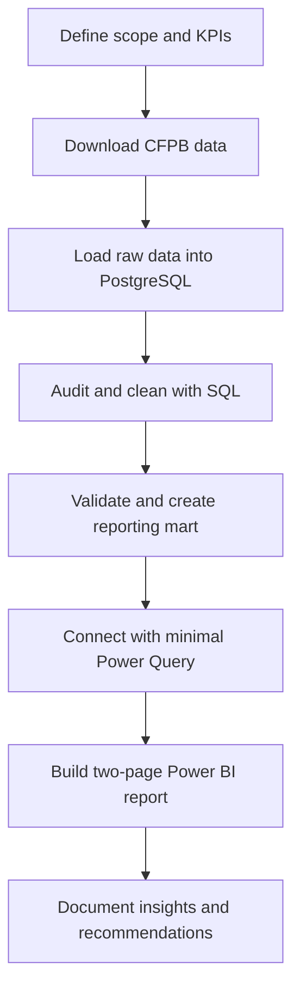

# Financial Complaints Analytics

> An end-to-end data analytics project for exploring consumer complaints in the US financial services industry.

**Project status:** Planning — MVP scope defined, implementation not started.

## Project overview

Financial institutions receive complaints across products, service channels, and operational processes. Turning those records into reliable management information can help customer operations and compliance teams identify where complaint volume is concentrated, which issues are growing, and where response performance may require attention.

This project will analyze public complaint records from the [Consumer Financial Protection Bureau (CFPB)](https://www.consumerfinance.gov/data-research/consumer-complaints/). The goal is to build a small, reproducible SQL analytics workflow and a clear Power BI report—not a predictive model or production data platform.

The project is intentionally scoped as a four-week portfolio MVP. It prioritizes business reasoning, data quality, practical SQL, and clear communication over architectural complexity. Python, notebooks, cloud services, and advanced BI features are deliberately excluded from the initial version.

## Business objective

The project will simulate an analytics request from a **Customer Operations or Compliance Manager** who needs to understand:

- how complaint volume and composition are changing;
- which products and issues account for most complaints;
- which issues are growing most rapidly; and
- how timely company responses vary across relevant segments.

The analysis is intended to support prioritization and monitoring. It will not be used to rank the overall quality of financial institutions or make causal claims.

## Questions to answer

1. How has monthly complaint volume changed during the selected period?
2. Which products and issues account for most complaint volume?
3. Which product–issue combinations are growing most rapidly?
4. How does the timely response rate vary by company, product, and submission channel?
5. Which high-volume areas should operations or compliance teams investigate first?

## Initial scope

- **Period:** 2022–2025, using four complete calendar years.
- **Geography:** United States.
- **Source:** CFPB Consumer Complaint Database.
- **Product focus:** three or four banking and payments product families, selected after the initial data audit.
- **Unit of analysis:** one published consumer complaint.
- **Dashboard:** two report pages with a limited set of business KPIs.

The full CFPB database will not automatically be included. Filtering the period and product families will keep processing and dashboard performance manageable while preserving a meaningful business problem.

## Planned workflow



## Planned technology stack

| Area | Technology | Intended use |
|---|---|---|
| Data ingestion | PostgreSQL `\copy` or documented import | Load the filtered CSV without altering the source values |
| Data storage | PostgreSQL | Preserve raw data and store the clean analytical layers |
| Data audit and cleaning | SQL | Profile, standardize, filter, and validate the complaint records |
| Analytical modeling | SQL | Create the reporting mart and calculate reusable business fields |
| Power Query | Power BI connector | Connect to PostgreSQL, select columns, and verify data types |
| Reporting | Power BI and basic DAX | Build the executive and operational report pages |
| Version control | Git and GitHub | Track code, queries, documentation, and project decisions |
| Documentation | Markdown | Explain methodology, metric definitions, findings, and limitations |

Python, notebooks, and Excel are not required for the MVP. Transformations will be completed in PostgreSQL before the data reaches Power BI, avoiding duplicated logic and unnecessary Power Query complexity.

## Planned analytical outputs

### Core metrics

- Total complaints.
- Monthly complaint volume.
- Year-over-year complaint growth.
- Timely response rate.
- Complaint distribution by product and issue.
- Narrative availability rate.

### SQL audit, cleaning, and analysis

The SQL portion will cover the complete preparation and analysis workflow using practical junior analyst skills:

- source profiling and duplicate detection;
- null and category checks;
- text and date standardization;
- filtering and grouping;
- conditional aggregations;
- `CASE WHEN` segmentation;
- simple common table expressions;
- joins with a calendar table; and
- one or two window-function examples for period comparisons or Pareto analysis.

Advanced procedures, dynamic SQL, recursive queries, and database optimization are outside the MVP.

### Power BI report

**Page 1 — Executive Overview**

- headline KPIs;
- monthly complaint trend;
- product mix;
- leading issues; and
- year and product filters.

**Page 2 — Company & Issue Analysis**

- company complaint volume;
- timely response rate;
- response category distribution;
- high-volume and fast-growing issues; and
- company, product, and channel filters.

The report will use a single analytical mart and a calendar table. Power Query will be limited to connection and presentation-level adjustments, while DAX will be limited to approximately six reusable measures.

## Planned deliverables

1. PostgreSQL scripts for raw data loading, auditing, cleaning, validation, and analytical modeling.
2. A documented data audit describing source quality and the resulting cleaning decisions.
3. A two-page Power BI report connected to the analytical mart.
4. A KPI dictionary describing definitions, calculation logic, and caveats.
5. A concise analytical summary with approximately five findings and three actionable recommendations.
6. Documentation explaining data quality decisions, limitations, and how to reproduce the project.

## Planned repository structure

```text
financial-complaints-analytics/
├── data/
│   └── README.md
├── sql/
│   ├── 01_create_raw_table.sql
│   ├── 02_data_audit.sql
│   ├── 03_clean_staging.sql
│   ├── 04_quality_checks.sql
│   ├── 05_reporting_mart.sql
│   └── 06_business_analysis.sql
├── powerbi/
│   └── README.md
├── docs/
│   ├── data_audit.md
│   ├── data_dictionary.md
│   ├── kpi_dictionary.md
│   └── findings.md
├── images/
└── README.md
```

The source dataset and generated data files will not be committed to the repository. The `data/README.md` file will document how to obtain them.

## Four-week roadmap

| Week | Focus | Planned result |
|---|---|---|
| 1 | Scope, download, PostgreSQL load, and SQL audit | Approved data contract and documented source profile |
| 2 | SQL cleaning, validation, and business analysis | Validated staging layer and reporting mart |
| 3 | KPI definitions and Power BI | Functional two-page report |
| 4 | Validation, findings, documentation, and presentation | Portfolio-ready MVP |

## Quality and interpretation safeguards

The project will explicitly validate:

- uniqueness of complaint identifiers;
- valid date ranges;
- required values and category consistency;
- record counts between the source file, raw table, staging layer, and reporting mart;
- metric reconciliation between SQL and Power BI; and
- minimum-volume thresholds for company comparisons.

Complaint counts must be interpreted carefully. The dataset does not provide the number of customers or transactions handled by each company. A larger complaint count therefore does not prove that a company has a higher true complaint rate or lower service quality.

## Out of scope for the MVP

- Cloud data warehouses.
- dbt, Airflow, or orchestration platforms.
- Python analysis and Jupyter notebooks.
- Automated API ingestion.
- Machine learning or complaint prediction.
- Advanced natural language processing.
- Census or external demographic enrichment.
- Excel-based analysis.
- Advanced Power Query or DAX.
- Real-time dashboards.

These items may be considered only after the initial version is complete and documented.

## Data source

Consumer Financial Protection Bureau. [Consumer Complaint Database](https://www.consumerfinance.gov/data-research/consumer-complaints/).

This repository is an independent portfolio project and is not affiliated with or endorsed by the CFPB.
