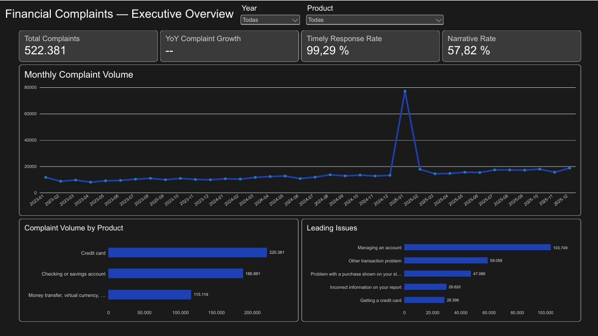
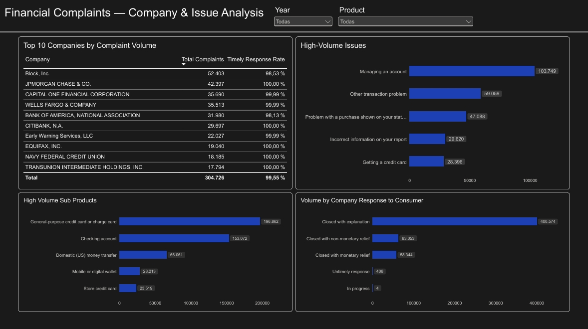
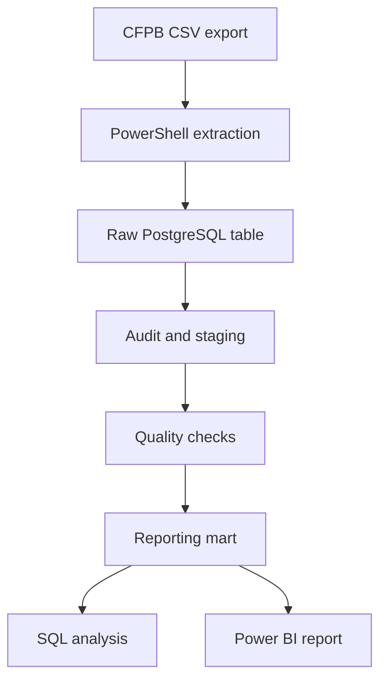

# Financial Complaints Analytics

**English** | [Español](README.es.md)

> A reproducible PostgreSQL and Power BI project for monitoring consumer complaints in U.S. banking and payments.

**Status:** Portfolio-ready MVP. The repository includes the extraction workflow, SQL pipeline, audit evidence, business analysis, final two-page Power BI report, dashboard previews, and metric documentation.



## Project Overview

Financial institutions receive complaints across products and operational processes, but raw complaint counts require careful preparation and interpretation before they can support management decisions.

This project turns public records from the [Consumer Financial Protection Bureau (CFPB) Consumer Complaint Database](https://www.consumerfinance.gov/data-research/consumer-complaints/) into a focused analytical workflow for a simulated **Customer Operations or Compliance Manager**. It supports monitoring and investigation of complaint volume, trends, product and issue concentration, company-level patterns, response timing, and narrative availability.

The goal is descriptive decision support—not complaint prediction, causal evaluation, or a general ranking of company quality.

## Tech Stack

PostgreSQL · SQL · PowerShell · `curl.exe` · Power BI · Power Query · DAX · Git/GitHub · Markdown

## Business Questions

- How did complaint volume change from 2023 through 2025?
- Which products and issues account for the greatest share of complaints?
- Which companies appear most often in the selected reporting context?
- How consistently were complaints recorded as receiving a timely response?
- Where should operations or compliance teams prioritize further investigation?

## MVP Scope

| Dimension | Definition |
|---|---|
| Period | 2023-01-01 through 2025-12-31 |
| Geography | United States |
| Unit of analysis | One published consumer complaint |
| Source | CFPB Consumer Complaint Database |
| Domain | Consumer banking and payments |
| Reporting | Two visible 16:9 Power BI pages plus one hidden QA page |

Four source product categories are extracted and harmonized into three analytical families:

- `Credit card`;
- `Checking or savings account`;
- `Money transfer, virtual currency, or money service`.

The historical `Credit card or prepaid card` category is resolved with `product + sub_product`. Credit-card records are mapped into the modern family; prepaid-card records remain preserved in raw data but are excluded from this MVP.

## Dashboard

The final report is available at [`powerbi/financial_complaints_analytics.pbix`](powerbi/financial_complaints_analytics.pbix). Its model, measures, pages, interactions, and SQL reconciliation are documented in the [Power BI report guide](powerbi/README.md).

### Executive Overview

The first page combines Year and Product slicers with Total Complaints, YoY Complaint Growth, Timely Response Rate, Narrative Rate, monthly complaint volume, product mix, and the five leading issues.

### Company & Issue Analysis

The second page presents the top ten companies by complaint volume with their timely response rate, plus high-volume issues, sub-products, and company response categories. Company volume is used for prioritization and is not presented as an exposure-adjusted quality ranking.



The `.pbix` also retains a hidden QA page used to reconcile global, annual, product, timely-response, and narrative-availability results against PostgreSQL.

## Key Findings

1. **Complaint volume increased materially.** The mart contains 118,035 complaints in 2023, 145,554 in 2024, and 258,792 in 2025. The corresponding annual changes are +23.31% and +77.80%.
2. **Credit cards are the largest product family overall.** They account for 220,381 complaints, or 42.19% of the validated mart.
3. **A small group of issues drives much of the workload.** The five leading issues represent 51.29% of complaints; `Managing an account` alone accounts for 103,749 complaints.
4. **Company volume is concentrated.** The ten highest-volume companies account for 58.33% of the mart, making them useful investigation anchors while not establishing comparative service quality.
5. **Recorded response timing is consistently high.** 518,681 complaints were marked timely, producing a 99.29% timely response rate. Narrative text is available for 302,021 complaints, or 57.82%.

Detailed results, supporting tables, and interpretation limits are available in the [business analysis](docs/business_analysis.md).

## Recommended Investigation Priorities

- **Investigate January 2025 before operationalizing growth conclusions.** Determine whether the concentration reflects reporting timing, backlog, company mix, classification, or another data-process factor.
- **Prioritize high-volume product–issue combinations.** Start with `Managing an account` for checking or savings accounts and `Other transaction problem` for money-transfer services, then segment by company and response category.
- **Review non-timely complaints in context.** Focus on segments that combine meaningful volume with lower observed response rates, while treating timeliness as a process indicator rather than a resolution-quality measure.

These are investigation priorities derived from descriptive patterns, not causal recommendations.

## Architecture



| Layer | Responsibility |
|---|---|
| PowerShell + `curl.exe` | Partition downloads, validate files, detect duplicate IDs, and write a hashed extraction manifest |
| PostgreSQL raw | Preserve all source columns as text before transformation |
| SQL audit | Profile integrity, missingness, taxonomy, normalization, and cleaning impact without modifying raw data |
| SQL staging | Apply audited casts, exclusions, product harmonization, and derived flags |
| SQL quality checks | Validate grain, population, required values, mappings, and date coverage |
| SQL reporting | Expose a complaint-grain mart and continuous calendar dimension |
| Power BI | Provide a small semantic model, reusable DAX measures, filters, and report pages |
| Markdown | Publish methodology, definitions, findings, limitations, and reproduction steps |

Transformation logic stays in PostgreSQL rather than being duplicated in Power Query.

## Data Quality and Cleaning

The published run starts with 525,156 raw rows and the same number of distinct complaint IDs. The audit supports 2,775 documented exclusions:

- 2,769 historical prepaid-card complaints outside the three-family scope;
- 5 complaints missing required product classification fields;
- 1 inconsistent checking/product pair.

The final staging and mart population is 522,381 unique complaints. All 18 staging checks pass.

Other decisions include:

- defining scope by `date_received`, even when `date_sent_to_company` falls later;
- preserving optional missing sub-issues and narratives rather than imputing them;
- deriving `has_narrative` only as an availability flag;
- consolidating three verified company casing variants while avoiding general entity resolution.

See the [data audit](docs/data_audit.md) and committed [audit evidence](data/audit/) for the complete rationale.

## Reporting Model and KPIs

Power BI imports only:

- `mart_complaints`, at one row per validated complaint;
- `dim_calendar`, at one row per date from 2023 through 2025.

The model uses an active one-to-many relationship from `dim_calendar[date]` to `mart_complaints[date_received]` with single-direction filtering.

Core measures are:

- Total Complaints;
- Complaints Previous Year;
- YoY Complaint Growth;
- Timely Complaints and Timely Response Rate;
- Complaints with Narrative and Narrative Rate.

Definitions, DAX, filter behavior, SQL reconciliation, and caveats are published in the [KPI dictionary](docs/kpi_dictionary.md). Reporting fields and derivations are documented in the [data dictionary](docs/data_dictionary.md).

## Reproduce the Workflow

### Requirements

- Windows PowerShell or PowerShell with access to `curl.exe`;
- PostgreSQL and the `psql` command-line client;
- network access to the CFPB complaint export;
- Power BI Desktop to open or refresh the report.

Run commands from the repository root because the SQL loader uses relative paths under `data/raw/`.

### Choose a review path

**Quick review — no database required**

- inspect the committed audit evidence under `data/audit/`;
- read `docs/data_audit.md` and `docs/business_analysis.md`;
- review the SQL scripts and KPI dictionary;
- inspect the dashboard previews or open the committed `.pbix`.

**Full reproduction**

Download the current CFPB extracts, build PostgreSQL from raw through the reporting mart, run the business analysis, and refresh Power BI using the steps below.

### PostgreSQL setup

Create an empty project database before running the pipeline:

```powershell
createdb -h <host> -p <port> -U <user> financial_complaints_analytics
```

Connection details can be supplied through the command arguments shown below or through PostgreSQL's standard `PGHOST`, `PGPORT`, `PGDATABASE`, `PGUSER`, and `PGPASSWORD` environment variables. The repository does not require or read an `.env` file.

Test the connection before downloading data:

```powershell
psql -h <host> -p <port> -U <user> `
  -d financial_complaints_analytics `
  -c "SELECT current_database();"
```

### 1. Download and validate source partitions

```powershell
powershell -ExecutionPolicy Bypass -File .\scripts\download_data.ps1
```

The extractor writes eight fixed, non-overlapping CSV partitions and `extraction_manifest.csv`. Existing files are validated and retained by default; use `-Force` to rebuild them.

The published extraction contains 525,156 rows and occupies approximately 480 MiB. Download, CSV validation, PostgreSQL loading, and audit queries can take more than a few minutes depending on network speed and local hardware. This is the full reproduction path, not the quick-review path.

### 2. Build the database pipeline

```powershell
psql -h <host> -p <port> -U <user> `
  -d financial_complaints_analytics `
  -f sql/00_run_pipeline.sql
```

The runner executes raw loading through mart creation with `ON_ERROR_STOP`. Individual scripts can also be run in numerical order. Any failed staging quality check stops the runner before the reporting mart is created.

### 3. Run the business analysis

```powershell
psql -h <host> -p <port> -U <user> `
  -d financial_complaints_analytics `
  -f sql/06_business_analysis.sql
```

This script is intentionally outside the build runner because it returns analytical result sets rather than creating a downstream layer.

### 4. Open or refresh Power BI

Open `powerbi/financial_complaints_analytics.pbix` and follow the [Power BI report guide](powerbi/README.md#refreshing-from-another-postgresql-instance) to configure and refresh the PostgreSQL connection. Use the hidden QA page to compare the refreshed results with the documented reference values.

Raw complaint files and generated manifests are excluded from Git. Reproduced counts may differ if the CFPB republishes source records. The versioned published manifest anchors the documented baseline, while the generated manifest identifies the local extraction used for a new run. See the [data directory guide](data/README.md) for artifact policy.

## Repository Structure

```text
financial-complaints-analytics/
├── data/
│   ├── audit/                       # Versioned aggregate audit evidence
│   ├── raw/                         # Generated CFPB extracts; ignored by Git
│   └── README.md                    # Data artifact and regeneration guide
├── docs/
│   ├── business_analysis.md         # Reconciled descriptive findings
│   ├── data_audit.md                # Audit results and cleaning decisions
│   ├── data_dictionary.md           # Reporting-table definitions
│   ├── images/                       # Final dashboard screenshots
│   └── kpi_dictionary.md            # Metric, DAX, and reconciliation definitions
├── powerbi/
│   ├── financial_complaints_analytics.pbix
│   └── README.md                    # Report model, pages, measures, and QA
├── scripts/
│   └── download_data.ps1
├── sql/
│   ├── 00_run_pipeline.sql
│   ├── 01_load_raw_data.sql
│   ├── 02_data_audit.sql
│   ├── 03_clean_staging.sql
│   ├── 04_quality_checks.sql
│   ├── 05_reporting_mart.sql
│   └── 06_business_analysis.sql
├── .gitignore
├── LICENSE
├── README.es.md
└── README.md
```

## Limitations

- The selected products are not the complete CFPB complaint universe.
- Complaints are observed reports, not a representative sample of all customer experiences.
- Company and product counts lack customer, account, transaction, and market-share denominators.
- Timely response measures response timing, not resolution quality or satisfaction.
- CFPB taxonomy, publication rules, and submission behavior may affect observed trends.
- Company labels receive limited audited casing normalization, not full entity resolution.
- Narrative availability does not imply analysis-ready or representative text.
- January 2025 materially affects 2025 growth comparisons.

## Deferred Extension: January 2025

The strongest unresolved signal is the combination:

`Money transfer, virtual currency, or money service` → `Other transaction problem`

It records 42,521 complaints in January 2025, equal to 55.09% of that month's total and 78.90% of the combination's 2025 volume. The project deliberately does not label this as a validated anomaly or assign a cause.

A post-MVP investigation should define the historical baseline, expected and excess volume, minimum-volume rules, company and channel concentration, and possible source-timing or classification effects. That work may support a dedicated third Power BI page; it is not required for the current two-page MVP.

## Out of Scope

- Machine learning, prediction, or NLP;
- cloud warehouses, dbt, or Airflow;
- real-time reporting;
- external demographic or market-share enrichment;
- advanced Power Query, DAX, RLS, drill-through, or custom navigation.

## Data Source

Consumer Financial Protection Bureau. [Consumer Complaint Database](https://www.consumerfinance.gov/data-research/consumer-complaints/).

This repository is an independent portfolio project and is not affiliated with or endorsed by the CFPB.
